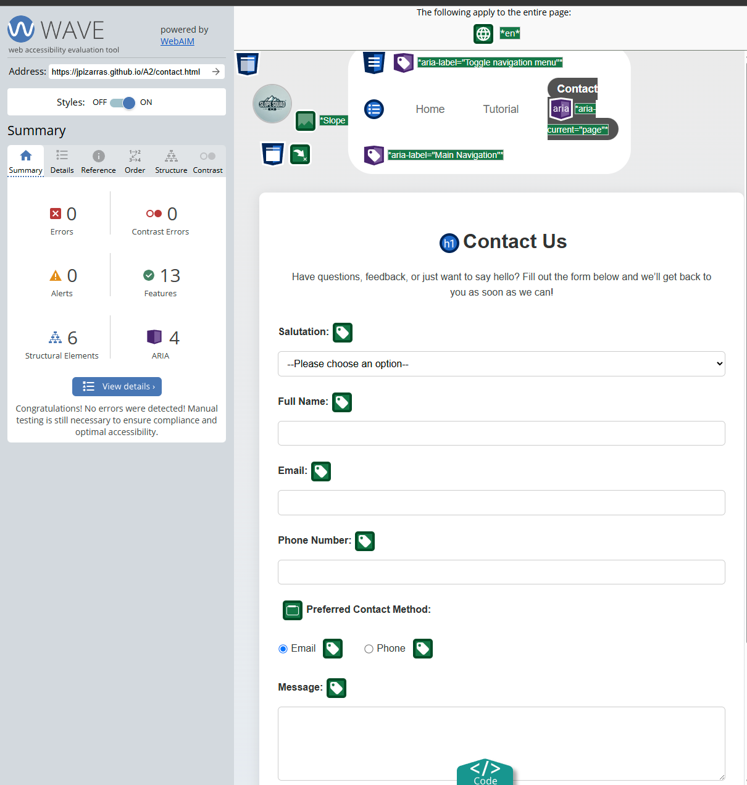
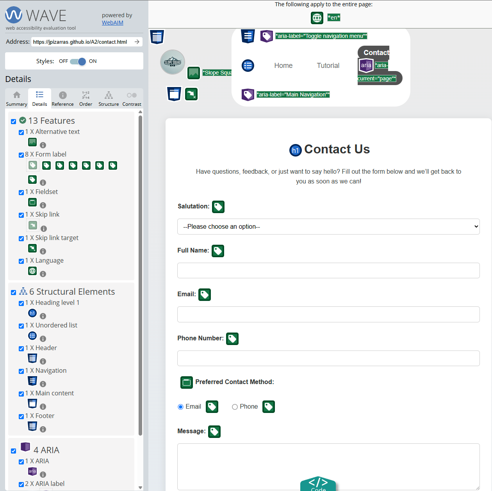

# Assignment 2 - COMP 2511

**Student Name:** Jan Pizarras  
**Course:** COMP 2511 - Web I: Client Development  
**Due Date:** March 28, 2025  
**Project Title:** Slope Squad – Responsive & Accessible Website  

---

## Project Overview

This project is a redesign of my Assignment 1 website for snowboarding beginners. The goal was to make the site responsive across devices and accessible to users with diverse abilities, following WCAG 2.0 guidelines.

---

## Tasks Completed (Individual Submission)

All work for this assignment was completed by me, Jan Pizarras.

---

## Responsive Design

- Implemented breakpoints at:
  - **<590px**: Small screen (single-column layout)
  - **590px–790px**: Medium screen (2x2 grid layout)
  - **>790px**: Large screen (centered content, max-width 790px)
- Used **CSS Grid** and **Flexbox**
- Mobile-first approach
- Used `normalize.css` to ensure consistent styling across browsers

---

## Accessibility Improvements

### Manual Checklist (WebAIM + Lecture Material)
- ✅ Added alt text and captions for all images
- ✅ Headings follow a logical and semantic hierarchy (only one `<h1>` per page)
- ✅ All form inputs have associated `<label>` tags
- ✅ Required inputs are visually indicated and use the `required` attribute
- ✅ Sufficient contrast for text and background
- ✅ Links are underlined or visually distinct
- ✅ All pages use semantic HTML5 elements (`<main>`, `<nav>`, `<section>`, `<article>`, etc.)
- ✅ Added a "Skip to Main Content" link for keyboard users

### WAVE Audit Summary

- Contact Page:

---

## Directory Structure

project-folder/ 
│── images/ # Contains website images 
│── style/ 
  └──  normalize.css # Normalize styles 
  └──  styles.css # Main CSS file 
│ 
├── index.html 
├── about.html 
├── contact.html 
├── README.txt

---

## How to View the Site

1. Open `index.html` in a web browser
2. Use the navigation bar to explore the other pages
3. Resize the browser to see responsiveness
4. Use keyboard navigation to test accessibility features

---

## Changes Made From Assignment 1

- Redesigned Website for a possible publish to Git Pages.
- Rebuilt layout using CSS Grid + Flexbox for responsive breakpoints
- Structured forms and headings to follow semantic order
- Improved color contrast and visual consistency
- Added accessible navigation (skip link, keyboard tab order)
- Optimized image sizing and layout across viewports
- Fixed form labels and input associations

---

## Conclusion

This project demonstrates:
- Responsive design using media queries, flexbox/grid
- Accessibility improvements based on WCAG 2.0 principles
- A clean, mobile-first layout with clear structure and styling

---
